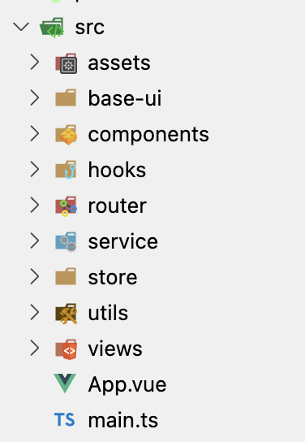

# vue3-ts-cms

新建项目时的配置。

## 一、创建项目

目前有两种脚手架用于创建 Vue 项目：

- `npm init @vue/latest`，创建一个基于 Vite 和 Rollup 的 Vue 项目，官方推荐
- `vue create <project-name>`， 创建一个基于 Vue Cli 和 Webpack 的项目

## 二、配置代码规范

### 1. 使用 editorconfig 统一不同编辑器的代码格式

用于统一不同 IDE 编辑源码的代码风格。`.editorconfig` 本身只是一个配置文件，代码风格的统一由 IDE 实现，EditorConfig 为不同 IDE 提供了插件实现规范功能。VS Code 中安装 `EditorConfig for VS Code` 插件，在根目录创建 `.editorconfig` 即可。配置内容参考本项目配置，或 Github 上开源项目如 Vue、React 的配置。

### 2. 使用 prettier 做代码美化

- 安装 prettier 库， `npm install -D prettier`
- 安装 VS Code 插件 prettier
- VS Code 设置 `format on save` & `default formatter` 中选择 prettier
- 项目根目录创建 `.prettierrc.json` 配置文件，具体配置参考本项目，或者 Github 上的开源项目

### 3. 使用 ESlint 进行代码检测

- 安装 ESLint 库，`npm install -D eslint`
- 安装 VS Code 插件 ESLint
- 解决 ESLint 格式与 prettier 格式冲突，安装 `eslint-plugin-prettier`，在 `.eslintrc.cjs` 配置文件的 `extends` 字段增加一条配置 `plugin:prettier/recommended`，此后 ESLint 在检查代码时会先读取 `.prettierrc.json` 中的配置

## 三、目录结构

`src` 目录结构

## 四、重置 CSS

### 使用 less 预处理器

`npm install -D less`

### 重设基本样式

不同的项目重设样式的方式相同。

- `npm install normalize.css`
- in `main.ts`, `import 'normalize.css'`
- 创建 `reset.less` 并导入

## 五、集成配置 vue-router 与 pinia

vue-router: 见 `src/router`
pinia: 见 `src/store`
